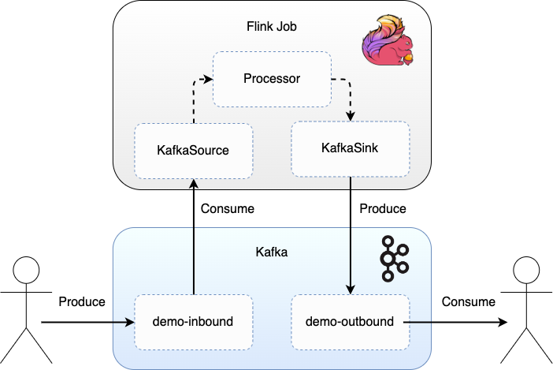
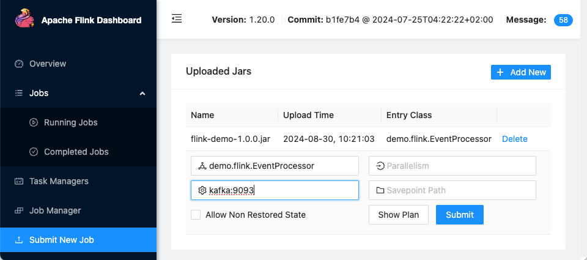
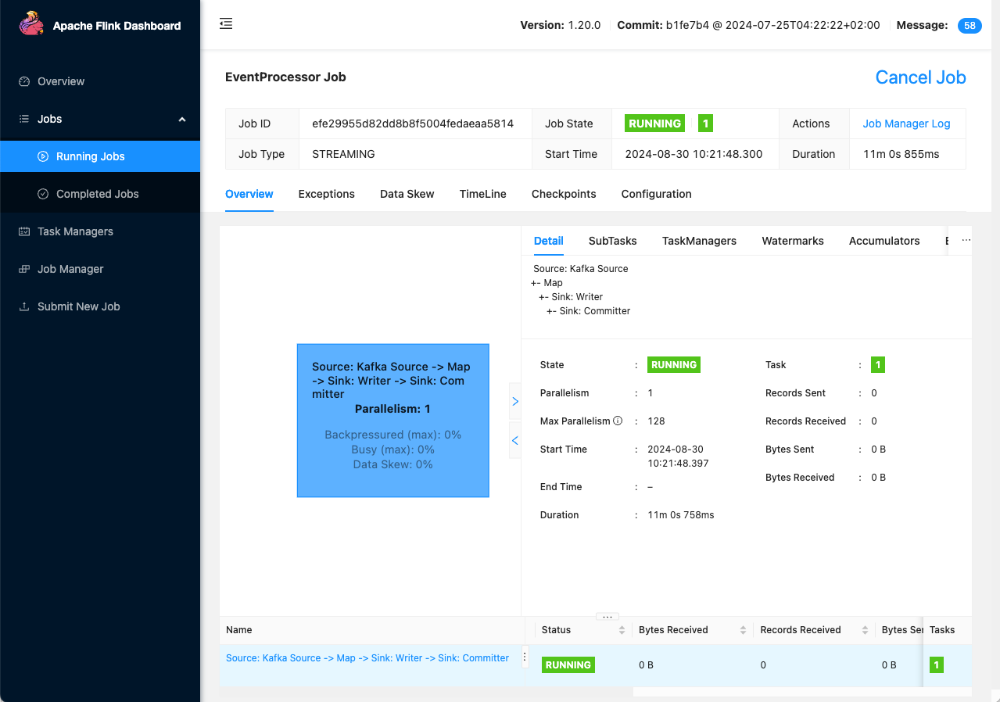

# Flink Integration with Kafka Demo

## Overview

Demonstrates running a Flink job that listens to Kafka for messages, transforms the message, then emits the transformed message back to Kafka.

<div style="text-align: center;">
    
</div>

## Running the Demo

The demo spins up Flink and Kafka in Docker containers, and steps through building the Flink application and submitting the job via the Flink console.  The Kafka command line tools are used to produce a message to Kafka which the Flink job processes by uppercasing the name, and to consume the resulting transformed message.  The message is in JSON format, containing a name field.  The Flink Kafka Source and Kafka Sink use a JSON deserializer and serializer respectively to marshal the message. 

Build the jar containing the Flink job:
```
mvn clean install
```

Bring up the Flink job and task managers, along with Kafka (and Zookeeper), in Docker containers (defined in `docker-compose.yml`):
```
docker-compose up -d
```

Ensure topics are created before the Flink job is submitted:
```
docker exec -ti kafka kafka-topics --create --topic=demo-inbound --partitions 3 --if-not-exists --bootstrap-server=kafka:9093
docker exec -ti kafka kafka-topics --create --topic=demo-outbound --partitions 3 --if-not-exists --bootstrap-server=kafka:9093
docker exec -ti kafka kafka-topics --list --bootstrap-server=kafka:9093
```

Navigate to the Flink console:
```
localhost:8081
```

Submit the new job:
`Add New` `flink-demo-1.0.0.jar` from the `target` dir.  Click on the jar and enter `Program Arguments`: `kafka:9093` for the Kafka bootstrap servers.  Click `Submit`.

<div style="text-align: center;">
    
</div>

The job will now be shown in the `Running Jobs` section:

<div style="text-align: center;">
    
</div>

Alternatively to run the Flink application manually (or manually with remote debug enabled):
```
java -jar target/flink-demo-1.0.0.jar
java -agentlib:jdwp=transport=dt_socket,server=y,suspend=n,address=*:5005 -jar target/flink-kafka-connector-1.0.0.jar
```

Produce a message to Kafka, which the Flink job will consume:
```
docker exec -ti kafka kafka-console-producer --topic demo-inbound --bootstrap-server kafka:9093
{"name":"John Smith"}
```

Consume the message from Kafka, which the Flink job will produce:
```
docker exec -ti kafka kafka-console-consumer --topic demo-outbound --bootstrap-server kafka:9093 --from-beginning
```
Expected output with uppercased name:  `{"name":"JOHN SMITH"}`

## Component Tests

The tests demonstrate sending events to a dockerised Kafka that are consumed by the dockerised Flink application, processed and transformed, resulting in outbound events being published.

The `Dockerfile` includes `$APP_ARGS` in the `ENTRYPOINT` to enable passing in extra args to the Flink application when it is running in the Docker container:  
```
ENTRYPOINT ["sh", "-c", "java ${JAVA_OPTS} -jar /app.jar ${APP_ARGS}"]
```

This is configured to the Kafka bootstrap servers URL `kafka:9092` in the `pom.xml` component test configuration under the `service.application.args` property, along with the other required configuration:
```
<service.name>${project.name}</service.name>
<kafka.enabled>true</kafka.enabled>
<kafka.topics>demo-inbound,demo-outbound</kafka.topics>
<service.startup.log.message>.*Flink job starting.*</service.startup.log.message>
<service.application.args>kafka:9092</service.application.args>
```
For more on the component tests see: https://github.com/lydtechconsulting/component-test-framework

Build Flink application jar:
```
mvn clean install
```

Build Docker container:
```
docker build -t ct/flink-kafka-connector:latest .
```

Run tests:
```
mvn test -Pcomponent
```

Run tests leaving containers up:
```
mvn test -Pcomponent -Dcontainers.stayup
```

Manual clean up (if left containers up):
```
docker rm -f $(docker ps -aq)
```

Further docker clean up if network/other issues:
```
docker system prune
docker volume prune
```
